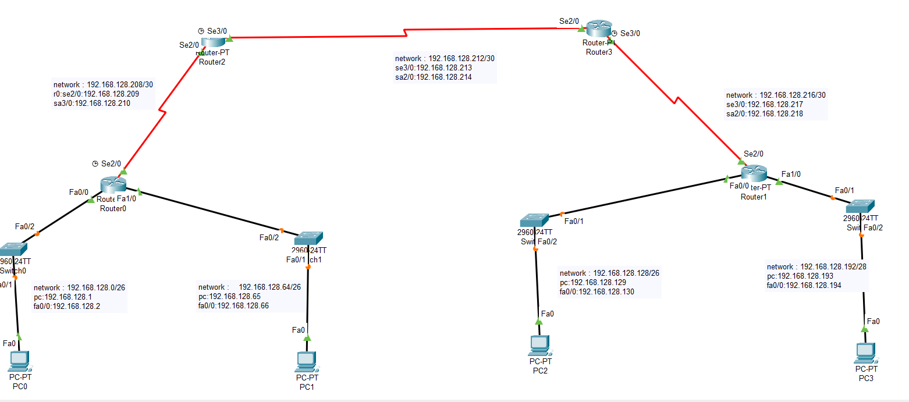

# 🛰️ Networking

This repository contains various networking designs and solutions created using **Cisco Packet Tracer**. It serves as a portfolio and a reference for solving common and advanced networking scenarios.

## 📌 Purpose

- Practice and demonstrate networking concepts.
- Use Cisco Packet Tracer to design, simulate, and troubleshoot networks.
- Explore topics such as:
  - Routing and switching
  - VLANs
  - Subnetting
  - Access Control Lists (ACL)
  - Static and Dynamic Routing

## 🧩 Tools Used

- Cisco Packet Tracer
- Git & GitHub for version control
- Markdown for documentation

---

## 📁 static_routing Setup



This setup showcases a basic **static routing** configuration between routers. Each router is manually configured with static routes to ensure connectivity.

### ✅ Features:
- Manually configured IP routes.
- Suitable for small networks.
- Helps understand the fundamentals of routing.

---

## 📁 dynamic_routing Setup (RIP)


This setup demonstrates **dynamic routing using RIP (Routing Information Protocol)**.

### ✅ Features:
- Configured RIP on all routers.
- Routing tables update automatically as the network changes.
- Easier to manage than static routes in growing networks.

### 🛠️ RIP Configuration Example:
```bash
Router(config)# router rip
Router(config-router)# version 2
Router(config-router)# network 192.168.1.0
Router(config-router)# network 192.168.2.0
